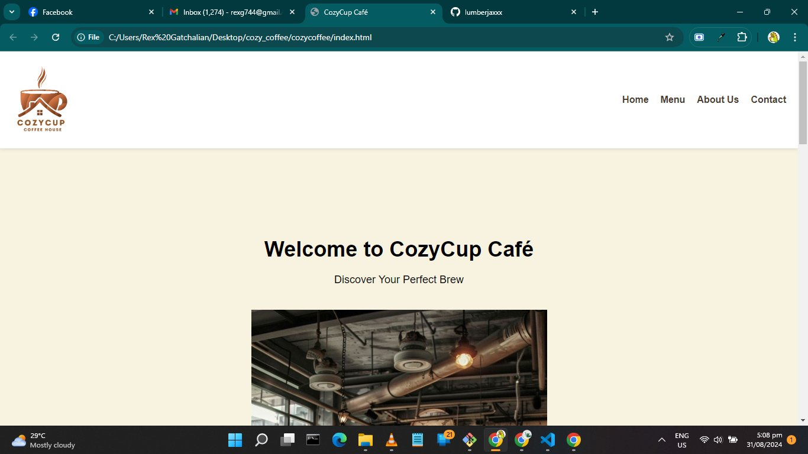
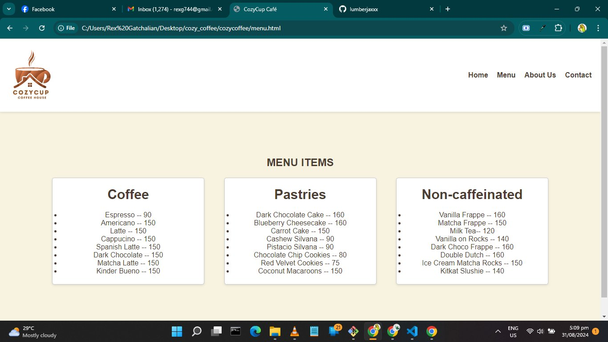
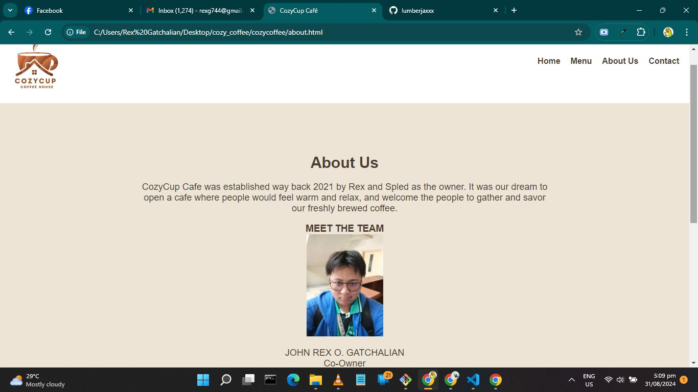
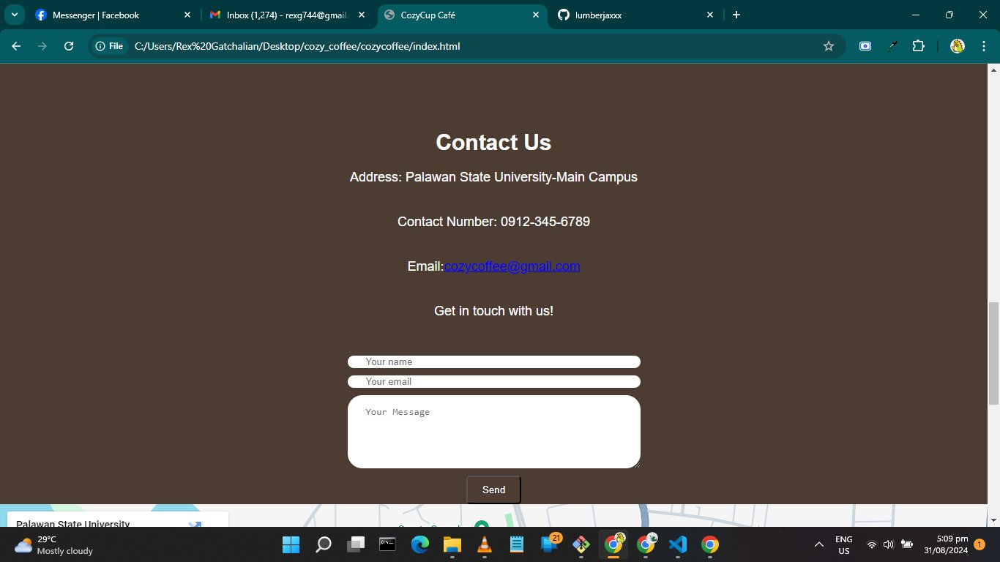
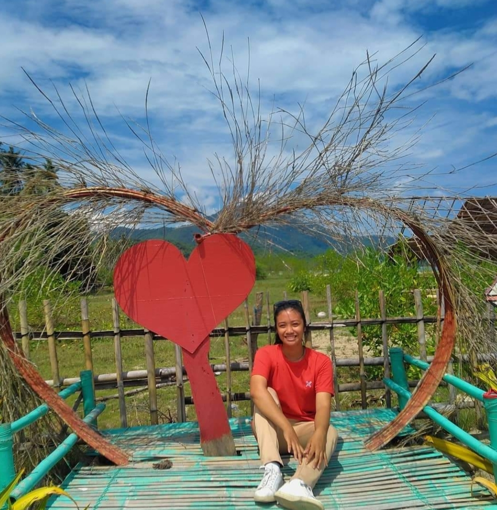

# Cozy Cafe
## Project Description
Cozycup Cafe is an online website where customers can browse more about what our cafe can offer to them.

## FEATURES

* HOME PAGE - this page shows the picture and the name of the cafe with an option to explore the menu. 

* MENU PAGE - this page shows the different kind of pastries and drinks that the cafe can offer to the customers. 

* ABOUT US PAGE - this page shows the brief information about the owners of the cafe and the mission of the cafe. 

* CONTACT US PAGE - this page is where you can find all of the information about the cafe such as locations, contact number, and social platforms where we promote more about our cafe.

## Screen Captures

This shows the interior of the cafe.

This shows the different kind of pastries and drinks. 

This shows the information of the owners. 

This shows the contact information of the cafe. 

## About the Authors 

**John Rex Gatchalian**

**Email**: [rexg744@gmail.com](mailto:rexg744@gmail.com)

**Socials**

**Spledelyn Cristine Recarze**

**Email** : [recarzespledelyncristine@gmail.com](mailto:recarzespledelyncristine@gmail.com)

**Socials**

